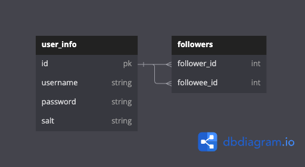

# Follow Feature

## About it

This is a repository for following each other on social media features.

## Entity Relationship Diagram

Because the followers are also users, this will be a many-to-many model.

 

## Features

1. Follow user
   - Users should be allowed to follow another user.
2. Unfollow user
   - Users should be allowed to unfollow other users.
3. Get followers
   - Users should get their followers.
4. Get following
   - Users should get their following.
5. Get friends
   - The definition of friends is users who follow each other.
   - Users should get their friends.

